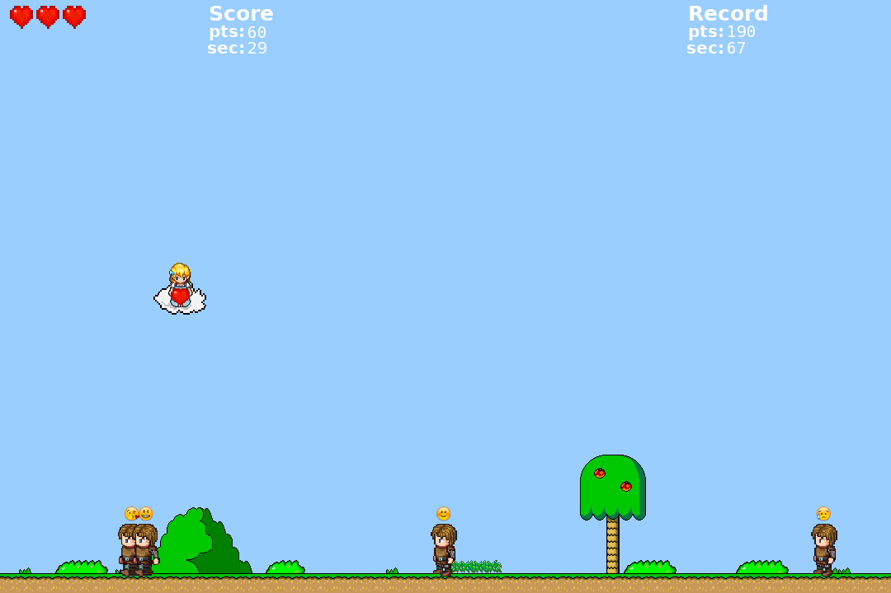

# Princess peace
### A Simple 2d game writed in c++/SFML
player control: arrow keys left,right and space
### Compilation
You must install SFML(2.5) -dev lib.

```sh
$ git clone https://github.com/Crabman77/Princess_peace.git
$ cd Princess_peace 
$ g++ -o princess_peace *.cpp -lsfml-graphics -lsfml-window -lsfml-audio -lsfml-system -std=c++14
```
Launch
```sh
./princess_peace
```




